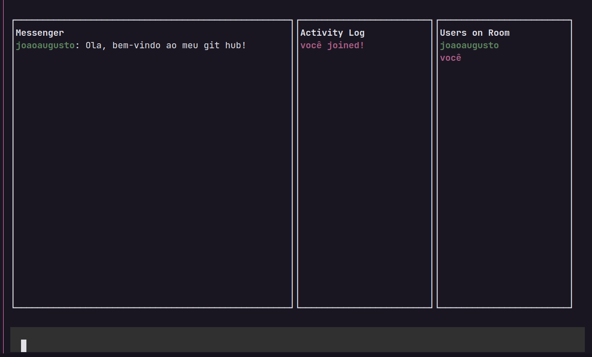

<div align="center">

<h1>Hacker-chat</h1>

<h3>

Projeto desenvolvido na Semana JS Expert, ministrada pelo [Erick_Wendel], utilizando **JAVASCRIPT** e **NodeJS**.

</h3>




</div>

<br>

## 📚 **Sobre**

Aplicação de mensageria baseado no Wechat, uma das maiores plataformas de mensageria do mundo.

<br>

## ✅ **Diferenciais**
- Interfaces interativas criadas usando somente terminal e linha de comando;
- Comunicação em tempo real sem frameworks usando apenas os módulos nativos do Node.js;
- Conceitos e práticas avançadas utilizando linguagem Javascript.

<br>

## 📌  **Tecnologias utilizadas**
- Javascript
- NodeJS
- Blessed

<br>
<br>

### 🚀 **Mão na massa**

```bash
# Baixe o pacote desta aplicação
npm i @joaoaugusto/hacker-chat-client

# Acesse com o seu nome
hacker-chat --username seunome
```

<br>
<br>

<h3 align="center">
Feito com 💜 por <a href="https://www.linkedin.com/in/joão-augusto-oliveira-dos-santos-9b0693195">João Augusto</a>
<br><br>

</h3>

<!-- Links -->

[Erick_Wendel]: https://cursos.erickwendel.com.br/


